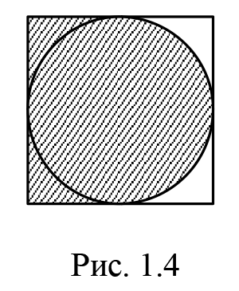
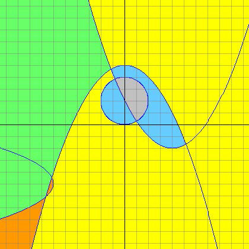
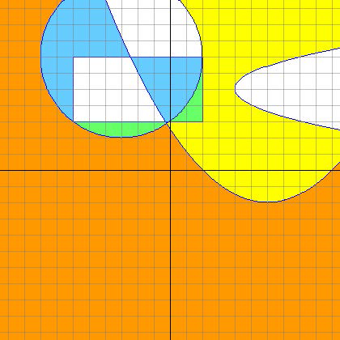
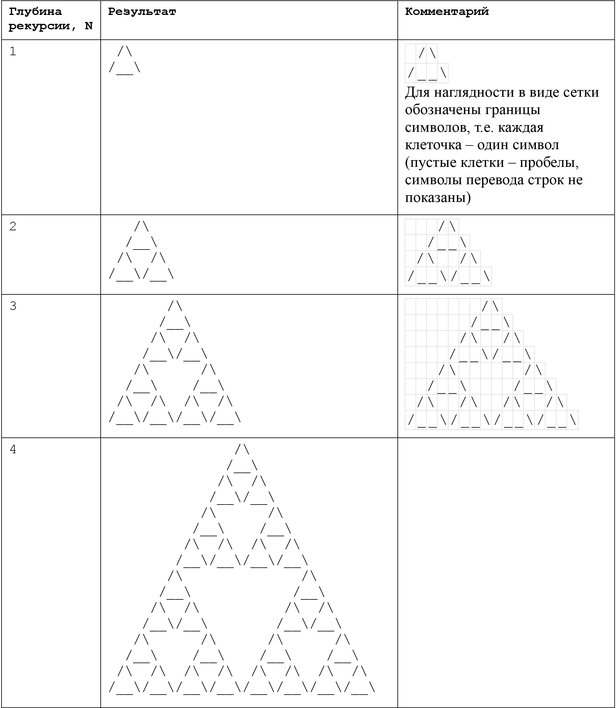

# Содержание
***
### Первый семестр:

* [Task1](#Task1)
* [Task2](#Task2)
* [Task3](#Task3)
* [Task4](#Task4)
* [Task5](#Task5)
* [Task6](#Task6)
* [Task7](#Task7)
* [Task8](#Task8)
* [Task9](#Task9)
* [Task10](#Task10)
* [Task11](#Task11)
* [Task12](#Task12)

***
### Первый семестр:

#### Task1

> Оператор присваивания.

*Для вычислений использовать отдельные функции (методы). Не использовать глобальные
переменные, все необходимые данные передавать в эти функции (методы).*

5\) В квадрат вписана окружность (рис. 1.4). Определить площадь заштрихованной части
фигуры, если известна длина стороны квадрата.




[Перейти к коду](tasks/task1/src/task1/Program.java)
***

#### Task2

>Условный оператор. Функции.

*Для ввода данных, вычислений и вывода данных использовать отдельные функции (методы). Не использовать глобальные переменные, все необходимые данные передавать в эти функции (методы).*

15\) Проверить, пройдет ли кирпич в прямой отверстие. Размеры кирпича — A, B, C (длина, высота, ширина — задаются в произвольном порядке). Размеры отверстия W, H (ширина, высота — задаются в произвольном порядке). Просовывать кирпич в отверстие разрешается только так, чтобы каждое из его ребер было параллельно или перпендикулярно каждой из сторон отверстия.

[Перейти к коду](tasks/task2/src/task2/Program.java)
***

#### Task3

> Условный оператор + функции + классы + перечисления
> \+ декомпозиция задачи (разбиение на подзадачи) + формальный подход.

<a name="list"></a> На изображениях ниже (для каждого варианта свое) приводится часть координатной плоскости (-10 <= x <
= 10, -10 <= y <= 10)
с графиками функций (парабола, линия) и фигурами (круг, прямоугольник). Размер одной клетки сетки – 1 (единица). Таким
образом параметры функций и фигур можно однозначно определить из рисунка.

Области, на которые разбивается плоскость графиками и контурами фигур, закрашены разными цветами (белый, серый, желтый,
оранжевый, голубой, зеленый). Необходимо реализовать программу, которая для точки (x, y)
определяет цвет области, в которую данная точка попадает. Будем считать, что если точка (x, y) попадает на линию графика
функции или контура фигуры, то правильным ответом будет цвет любой соседней области. Также стоит заметить, что некоторые
комбинации линий предполагают их пересечение за пределами изображенного на рисунке фрагмента плоскости поэтому, чтобы
исключить неопределенность ответа, допустимыми значениями (x, y) являются только такие, которые попадают в приведенное
изображение.

В программе должна быть реализована функция (статический метод), которая для точки (x, y) возвращает цвет точки на
изображении.

В методе Main необходимо для несколько заранее выбранных точек на рисунке (обязательно должны быть охвачены все области,
на которые разбивается плоскость) распечатать результат, который возвращает getColor (и самостоятельно убедиться, что
данная функция работает корректно). Также программа должна запрашивать координаты одной произвольной точки, и для нее
таким же образом печатать результат.

88\)


[Перейти к коду](tasks/task3/src/task3/Main.java)

15\)


[Перейти к коду](tasks/task3.1/src/task3_1/Main.java)

***

#### Task4
>Циклы

*Для вычислений использовать отдельную функцию (в некоторых задачах потребуются также
дополнительные функции). Для вычислений запрещено использовать массивы и строки (для
ввода/вывода строки, естественно, можно использовать).*

7\) Составить программу вычисления при заданных x и a значения функции y вида:

$$y=\frac{(x-2)(x-4)(x-6)...(x-64)}{(x-1)(x-3)(x-5)...(x-63)};$$

$$y=(((((x-a)x-a)x-a)x-a)-a)x-a.$$


[Перейти к коду](tasks/task4/src/task4/Main.java)
***

#### Task5
>Вложенные циклы. Простые алгоритмы.

Напечатать в консоле следующие фигуры.
Для печати реализовать отдельную функцию с параметрами.
Для различных вариантов могут быть заданы следующие параметры:

+ h – высота фигуры
+ w – ширина фигуры
+ s – размер фигуры

Для каждого варианта указаны допустимые значения данных параметров, а также в скобках приведены значения параметров для
приведенного примера.

*Запрещено использовать строки, массивы, а также управлять курсором, можно только использовать циклы, условный оператор,
а также Console.Write(...) и Console.WriteLine(…).*

6\)
```
h >= 1, w >= 1 (в примере ниже: h = 8, w = 15)
012345678901234
 01234567890123
  0123456789012
   012345678901
    01234567890
     0123456789
      012345678
       01234567
```
[Перейти к коду](tasks/task5/src/task5/Main.java)

29\)
```
s >= 2, s — четное (в примере ниже: s = 10)
    0
   01
  012
 0123
01234
     43210
     3210
     210
     10
     0
```
[Перейти к коду](tasks/task5.1/src/task5_1/Main.java)
***

#### Task6
>Циклы, ряды.

При некоторых заданных x (допустимые значения x – интервал (-R, R)), n и e, определяемых вводом, вычислить:

1) сумму n слагаемых заданного вида;
2) сумму тех слагаемых, которые по абсолютной величине больше e;
3) сумму тех слагаемых, которые по абсолютной величине больше e/10;
4) значение функции с помощью методов Math.

*При вычислениях необходимо выразить an (n-ый член ряда)
как зависимость от n, an-1 и x, т.е. виде an = f(n, an-1, x). Другие варианты решения не принимаются.
Использовать только 1 цикл.*

21\)

$$e^{-x}=1-x+\frac{x^{2}}{2!}-\frac{x^{3}}{3!}+...+\frac{(-1)^{n}x^{n}}{n!}+... (R = \infty)$$

[Перейти к коду](tasks/task6/src/task6/Main.java)
***

#### Task7
>Одномерные массивы (только чтение)

 *Для вычислений использовать отдельную функцию solution (необходимые параметры и возвращаемое значение определяются условием конкретного варианта задачи) .В некоторых задачах потребуются также дополнительные функции.*

 *Заранее придумать не менее 10 различных тестов, охватывающих как типичные, так и все возможные граничные (наиболее невероятные и показательные) ситуации. Программа при запуске должна прогонять эти тесты (для каждого теста распечатывать входной массив и результат), а также предлагать пользователю задать произвольный массив в качестве входных данных.*

 *Для ввода и, если необходимо, вывода одномерных массивов разработать отдельные функции.*

7\) Вводится массив целых чисел. Посчитать сумму элементов между последним четным и последним нечетным элементом.

[Перейти к коду](tasks/task7/src/task7/Main.java)
***

#### Task8
>Многомерные (двумерные) массивы

9\) Осуществить циклический сдвиг диагоналей двумерного массива на n позиций. Пример для n = 1:
```
({{ 1, 2, 3, 4, 5 },                {{ 12, 13, 14, 15, 11 },
  { 6, 7, 8, 9, 10 },           →    { 2, 3, 4, 5, 1 },
  { 11, 12, 13, 14, 15 }}, 1)        { 7, 8, 9, 10, 6 } }
```

##### Важно!

Входные данные для этой задачи должны читаться из текстового файла, 
а выходные – записываться в текстовый файл.
 
 Данная задача должна быть оформлена двумя способами:
 
 1) в виде консольного приложения с разбором параметров командной строки,
 
 2) в виде оконного приложения, где двумерный массив 
 можно задать в JTable. При этом должна быть возможность 
 загрузить данный из файла в JTable 
 (реализованная в виде двух функций: чтение данных из файла
 в двумерный массив и отображение двумерного массива в JTable),
 а также сохранить данные из JTable в файл (реализованная в виде двух 
 функций: чтение данных из JTable в двумерный массив 
 и запись двумерного массива в файл).
 
 *Функции, реализующие логику задачи и чтение 
 / запись данных из файлов / 
 в файлы, должны быть оформлены в виде отдельного модуля 
 (в отдельном файле). Этот модуль без каких-либо изменений должен использоваться в двух программах: с консольным
 интерфейсом
 (файлы для чтения / записи задаются в параметрах командной строки)
 и оконным интерфейсом.*

+ Заранее придумать не менее 5 различных тестов, охватывающих как типичные, так и все возможные граничные (наиболее
  невероятные и показательные) ситуации.
  (Сохранить в текстовых файлах input01.txt, input02.txt и т. д.)

+ Решение, естественно, должно быть оформлено в виде отдельной функции. В реализации обязательно использовать
  вспомогательные функции
  (в этой задаче, какие именно вспомогательные функции использовать, не расписано, вы должны самостоятельно решить,
  какие именно будут удобны для вашего варианта).

+ В данных задачах, если явно не оговорено иное, предполагается, что все строки двумерного массива имеют одинаковую
  длину, т.е. массив является прямоугольным. В реализации разрешено также использовать вместо прямоугольных массивов
  ступенчатые массивы
  (т.е. массивы массивов или списки списков). В этом случае необходимо дополнительно реализовать функцию проверки
  «прямоугольности» ступенчатого массива, которую применять для проверки корректности данных перед обработкой.

[Перейти к коду](tasks/task8/src/task8/Task.java)
***

#### Task9
>Списки (List<T> – то же самое, что одномерные массивы, только лучше)

5\) Составить новый список из первых n минимальных чисел переданного списка, взятых по одному разу. Если в переданном списке нет n различных чисел, то итоговый список будет короче n.
Примеры:
```
  ({ 7, 2, 3, 2, 2, 6, 5, 7, 8, 8, 3 }, 4) → { 2, 3, 5, 6 } 
  ({ 3, 3, 7, 3, 5, 3 }, 5) → { 3, 5, 7 }
```

Реализовать в виде функции:
`public static List<Integer> createNewList(List<Integer> list, int n)`

##### Важно!

Входные данные для этой задачи должны читаться из текстового файла, а выходные – записываться в текстовый файл.

В файле каждый набор чисел (массив / список), а также другие параметры, если они предусмотрены условием задачи, должны
быть записаны на отдельной строке.

Данная задача должна быть оформлена двумя способами:

1) В виде консольного приложения с разбором параметров командной строки,

2) В виде оконного приложения, где двумерный массив можно задать в JTable. При этом должна быть возможность загрузить
   данный из файла в JTable
   (реализованная в виде двух функций: чтение данных из файла в двумерный массив и отображение двумерного массива в
   JTable), а также сохранить данные из JTable в файл
   (реализованная в виде двух функций:
   чтение данных из JTable в двумерный массив и запись двумерного массива в файл).

*Функции, реализующие логику задачи и чтение / запись данных из файлов / в файлы, должны быть оформлены в виде
отдельного модуля (в отдельном файле). Этот модуль без каких-либо изменений должен использоваться в двух программах:
с консольным интерфейсом (файлы для чтения / записи задаются в параметрах командной строки)
и оконным интерфейсом.*

+ Заранее придумать не менее 10 различных тестов, охватывающих как типичные, так и все возможные граничные (наиболее
  невероятные и показательные) ситуации.
  (Сохранить в текстовых файлах input01.txt, input02.txt и т. д.)
  Решение, естественно, должно быть оформлено в виде отдельной функции. В реализации обязательно использовать
  вспомогательные функции.


+ Запрещено использовать любые стандартные (уже реализованные в библиотеке языка Java)
  функции и методы массивов и списков (за исключением создания списка, получения размера и добавления нового элемента).
  Аналоги стандартных функций необходимо реализовать
  (какие – для каждого варианта указано отдельно).

[Перейти к коду](tasks/task9/src/task9/Task.java)
***

#### Task10
>Массивы / списки объектов (классов)

3\) Отрезок на прямой линии задается координатой начала A и координатой окончания B (точки начала и окончания отрезка принадлежат отрезку). Задан набор отрезков, которые могут накладываться друг на друга. Необходимо выполнить объединение этих отрезков, представив результат также в виде набора отрезков.
Подсказка: перед объединением необходимо отсортировать отрезки по координате начала отрезка.

##### Важно!

В задаче обязательно использовать свои (описанные в вашей программе) составные типы данных (структуры или классы). Для
представления набора объектов лучше использовать списки (массивы также допустимы, но менее удобны для данной задачи).

##### Данная задача должна быть оформлена двумя способами:

1) в виде консольного приложения;

2) в виде оконного приложения, где массив объектов можно задать в JTable. При этом должна быть возможность загрузить
   данный из файла в JTable (реализованная в виде двух функций: чтение данных из файла в двумерный массив и отображение
   двумерного массива в JTable), а также сохранить данные из JTable в файл (реализованная в виде двух функций:
   чтение данных из JTable в двумерный массив и запись двумерного массива в файл).

+ Функции, реализующие логику задачи и чтение / запись данных из файлов / в файлы, должны быть оформлены в виде
  отдельного модуля (в отдельном файле). Этот модуль без каких-либо изменений должен использоваться в двух программах:
  с консольным интерфейсом (файлы для чтения / записи задаются в параметрах командной строки) и оконным интерфейсом.
  

+ Данные в файлах должны храниться в следующем виде: каждая отдельная строка описывает отдельный объект. Соответственно
  строки состоят из нескольких элементов (чисел, строк), каждый из которых описывает отдельный атрибут объекта.
  Например, набор линий вида ax + by + c = 0 будет храниться в текстовом файле в следующем виде:

  4 5 4
  10 2 12
  5 34 23

  и т.д.

  где каждая строка описывает отдельную линию с параметрами a, b, c.

*Заранее придумать не менее 5 различных тестов, охватывающих как типичные, так и все возможные граничные
(наиболее невероятные и показательные) ситуации. (Сохранить в текстовых файлах input01.txt, input02.txt и т. д.)*

Решение, естественно, должно быть оформлено в виде отдельной функции. В реализации обязательно использовать
вспомогательные функции примерно так же, как в предыдущих Задачах № 8 - 9 (в этой задаче, какие именно вспомогательные
функции использовать, не расписано, вы должны самостоятельно решить, какие именно будут удобны для вашего варианта).

[Перейти к коду](tasks/task10/src/task10/Task.java)
***

#### Task11
>Строки

1\) Реализовать функции кодирования и декодирования текста заменой букв текста симметричными относительно середины алфавита буквами, т.е. буква А должна заменяться буквой Я (а Я, наоборот, буквой А), Б – буквой Ю (а Ю – буквой Б) и т.д. Такая же логика действует для замены латинских букв. Меняться должны как прописные, так и строчные буквы (при этом прописные буквы остаются прописными, а строчные – строчными). Подсказка: в программе в виде строковой константы должен быть задан русский и латинский алфавит и все манипуляции с текстом производятся работой с данной константой (ни в коем случае программа не должна содержать отдельные условные операторы для замены каждой буквы).

*Заранее придумать не менее 5 различных тестов, охватывающих как типичные, так и все возможные граничные (наиболее невероятные и показательные) ситуации.
Как обычно, решение должно быть оформлено в виде отдельной функции / функций или класса.
Если в задаче используются регулярные выражения, то вы должны очень хорошо понимать, что это, и все особенности применительно к вашей задаче!
Если в вашем решении используется многократная конкатенация строк (не один-два-три раза, а именно многократная), то для эффективности использовать StringBuilder.
В задачах, где необходимо выбрать что-то без повторений, удобным (и эффективным в плане быстродействия) будет использовать Set<String> (HashSet<String> или TreeSet<String>) для хранения уже выбранных элементов. В задачах, где необходимо строке сопоставить какое-то значение, можно воспользоваться Map<String, Integer> (HashMap<String, Integer> или TreeMap<String, Integer>).*

[Перейти к коду](tasks/task11/src/task11/Task.java)
***

#### Task12
>Рекурсия

9\) Сгенерировать треугольник Серпинского с помощью псевдографики в следующем виде:


[Перейти к коду](tasks/task12/src/task12/Main.java)
***


